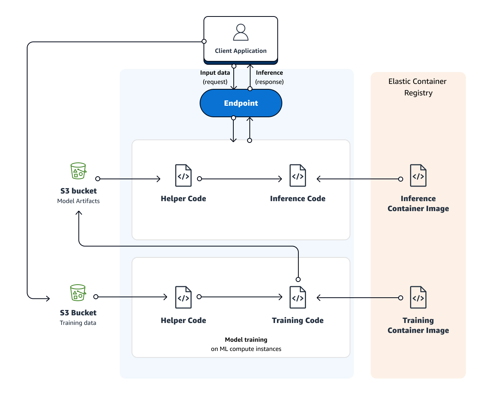

# sagemaker_inference

# Activate venv
source .venv/bin/activate
pip install -r path/to/requirements.txt

# 今回採用しているアーキテクチャ

# DockerイメージをECRにプッシュする
AWS_PROFILE=yukihirano0425 ./build_and_push.sh

# 訓練モデルを実行する
python3 path/to/create_training_job.py